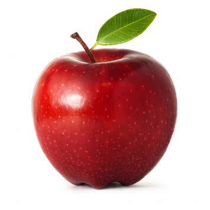

# Tensortree Examples

## Printing, Binding, Permuting

We've seen that the `tensortree` package can help illuminate tensors via custom printouts, for example in exploring the `mnist` dataset.

```{r}
library(keras)
library(tensortree)

mnist <- dataset_mnist()   # load mnist dataset

train_images <- mnist$train$x
train_labels <- mnist$train$y
```

To start with, we need to add some metadata to the tensors by converting them with `as.tensortree()` or `tt()` for short:

```{r}
print(tt(train_images))
```

Using `%>%` syntax, the above would be `train_images %>% tt() %>% print()`. The `print()` function can take a variety of parameters, for example the number of entries to show for the last 1, 2, or 3 ranks (default = 6). Let's see 16 x 16 chunks of our images:

```{r}
train_images %>% tt() %>% print(end_n = 16)
```

And we can adjust how many entries to show per level above that, here to just show one:

```{r smalltext}
train_images %>% tt() %>% print(end_n = 16, max_per_level = 1)
```

Let's play with some other data by using `keras`' `image_load()` and `image_to_array()` function to read two JPG files into tensors.

 

For ease of visualization we're going to scale them to just 10x10, and for now we'll format them with `channels_first`, resulting in rank-3 tensors with shape `(3, 10, 10)`.

```{r}
# read raw image data,
# convert to tensor with a 'channels-first' representation
# and convert to tt() 
strawberry <- image_load("images/strawberry.jpg", target_size = c(10, 10)) %>%
              image_to_array(data_format = "channels_first") %>% 
              tt()

apple <- image_load("images/apple.jpg", target_size = c(10, 10)) %>%
         image_to_array(data_format = "channels_first") %>%
         tt()


apple %>% print(max_per_level = 3)
```

We can 'bind' tensors together to create a new tensor of higher rank; in this case a `(3, 10, 10)` tensor bound to a `(3, 10, 10)`
tensor will result in a `(2, 3, 10, 10)` tensor (images, channels, rows, columns).^[This function is a thin wrapper around `abind()` from the `abind` package.]

```{r}
images <- bind(apple, strawberry)

images
```

We can permute the ranks of a tensortree if we wish, for example to convert our channels-first tensor into a channels-last tensor (shape `(2, 10, 10, 3)`).^[This is a fairly thin wrapper around the base-R function `aperm()`.]

```{r}
images_channels_last <- images %>% permute(c(1, 3, 4, 2))
```

If the last rank of a tensor is of size 3, the printout assumes the tensor represents a color channels-last image, and so prints the last three ranks in "3d", where the channel values are shown as embedded vectors:

```{r}
images_channels_last %>% print()
```

The `print()` function for tensortrees attemtps to guess whether the bottom ranks should be displayed as `"3d"` (as seen here), `"2d"` (earlier), or `"1d"`. This can be set explictly by setting the `bottom = ` parameter to one of these 3.

```{r}
images_channels_last %>% print(end_n = 5, bottom = "1d")
```


## Rank Names

Normal R arrays and matrices can accept "dimnames" - names for each entry of every dimension. For example, we may have a 3 by 4 matrix encoding four peoples' favorite colors, stored as red, green, and blue values. 

```{r}
fav_colors <- array_reshape(runif(12, min = 0, max = 1),
                            dim = c(3, 4))

dimnames(fav_colors) <- list(c("r", "g", "b"),
                             c("p1", "p2", "p3", "p4"))

print(fav_colors)
```

Tensortrees an print these dimension names if the `show_names = TRUE` option is set.

```{r}
fav_colors %>% tt() %>% print(show_names = TRUE, bottom = "2d")
```

Another handy feature added to tensortrees is the ability to name the ranks themselves. Let's set the ranknames for this tensor to `"channels"` and `"people"`. This gives us an extra bit of information in the printout indicated that rows represents channels, and columns represent people.

```{r}
fav_colors %>% tt() %>% 
  set_ranknames(c("channels", "people")) %>% 
  print(show_names = TRUE, bottom = "2d")
```

Same thing, but without `show_names = TRUE`.

```{r}
fav_colors %>% tt() %>% 
  set_ranknames(c("channels", "people")) %>% 
  print(bottom = "2d")
```

Now let's return to our original apple and strawberry image data, which was channels-first with a shape of `(2, 3, 10, 10)`. Let's process this tensor into one with ranknames set, permuted to a channels-last representation (which we can do by ranknames if they are set), and lastly set the dimension names for just the 'channels' rank.

```{r}
# images is already a tensortree, so no need to run through tt()
images_annotated <- images %>% 
  set_ranknames(c("images", "channels", "rows", "cols")) %>%
  permute(c("images", "rows", "cols", "channels")) %>%
  set_dimnames_for_rank("channels", c("r", "g", "b"))

print(images_annotated)    # Shawn TODO: show_names = T here produces a bug
```

There's a bug in attempting to show the dimension names for the channels rank, but having this rank's entries named `"r"`, `"g"`, and `"b"` allows us to extract for example just the red channel of the first image with:

```{r}
images_annotated[1, , , "r"]    # first image, all rows and cols, 'r' channel
```

## Data Frames and Plotting

Tensortrees can be easily 'deconstructed' into data frames with the `as.data.frame()` function. Here's a quick example for a small rank-2 tensor.

```{r}
tensor <- array_reshape(1:12, dim = c(3, 4)) %>% tt()
print(tensor, bottom = "2d")

tensor_df <- as.data.frame(tensor)
print(tensor_df)
```

Row 8 in the above output indicates that `tensor[2, 3]` holds value `7`. If any ranknames or dimension names are set, then we get more information in the resulting dataframe. Here's the result for the `images_annotated` tensor above.

```{r}
images_df <- as.data.frame(images_annotated)

print(head(images_df))
```

Now the ranknames are used for column names, and in the case of dimension names (such as our r, g, b channels) those names are used as column entries. Row four indicates that `images_annotated[2, 2, 1, "r"]` stores value 253.^[Be aware that storing tensor data as a data frame is *very* inefficient. For a shape `(1000, 28, 28, 3)` tensor, the number of rows is the product of rank sizes, `1000 * 28 * 28 * 3 = 2352000` (2.3 million!). Worse yet, the number of columns equals the number of ranks (plus 1 for the value), so this small tensor would become a data frame with 11.7 million entries. Be default `as.data.frame()` with throw an error if the number of entries would be larger than 1 million to avoid accidental crashes - to override this we can specify `allow_huge = TRUE`.]

Being able to convert a tensor into a 'tidy' data frame lets us visualize their contents easily with `ggplot2`. I'm going to assume some familiarity with `ggplot2` - for a detailed overview, see [here](http://library.open.oregonstate.edu/computationalbiology/chapter/plotting-data-and-ggplot2/).

```{r}
library(ggplot2)

images_df %>% ggplot() +
  geom_tile(aes(y = rows, x = cols, fill = value)) +
  facet_grid(images ~ channels) +
  coord_equal()
```

It's a bit hard to see the apple and strawberry, but they are there! If we want to visualize them as color images (rather than channels separately), we can do that, but we first have to use `tidyr`'s `spread()` function to pull the R, G, and B data into separate columns.

```{r}
library(tidyr)
images_df_rgb <- images_df %>% spread(channels, value)

images_df_rgb %>% head()
```

From there, we can create a new 'color' column using the built-in `rgb()` function.

```{r}
images_df_rgb$color <- rgb(images_df_rgb$r, 
                           images_df_rgb$g, 
                           images_df_rgb$b, 
                           maxColorValue = 255)

images_df_rgb %>% head()
```

The new column is of type "character" and specifies colors using a standard `#RRGGBB` hex-encoding. We can plot this data with `ggplot` using `scale_fill_identity()`.

```{r}
ggplot(images_df_rgb) +
  geom_tile(aes(y = rows, x = cols, fill = color)) +
  facet_grid(images ~ .) +
  coord_equal() +
  scale_fill_identity()
```

Pretty neat! But, they're upside down. The reason for this is that when working with image data, the (0,0)-coordinate is usually in the *top-left* of the image, with a flipped y axis.^[I believe harkening back to the olden days of teletype terminals, where the first character appears in the upper-left of the printed output.] We can fix this by just using `y = -1 * rows`. 

Putting this all together, here's a pipeline turning our raw `images` tensor (shape `(2, 3, 10, 10)`) into a dataframe and plotting it.

```{r}
library(dplyr)

images %>%                                                      # tensortree, shape (2, 3, 10, 10)
  set_ranknames(c("images", "channels", "rows", "cols")) %>%    # set rank names
  set_dimnames_for_rank("channels", c("r", "g", "b")) %>%       # set dimnames for the channels rank
  as.data.frame(allow_huge = T) %>%                             # convert to data frame
  spread(channels, value) %>%                                   # spread channels data (tidyr)
  mutate(color = rgb(r, g, b, maxColorValue = 255)) %>%         # compute color column (dplyr)
  ggplot() +                                                    # plot (ggplot2)
    geom_tile(aes(y = -1 * rows, x = cols, fill = color)) +
    facet_grid(images ~ .) +
    coord_equal() +
    scale_fill_identity()
```


